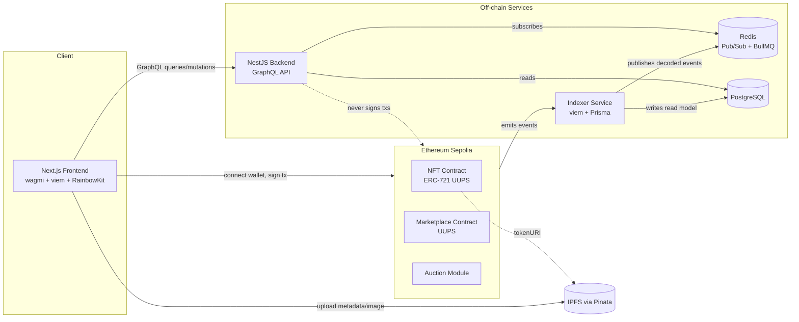
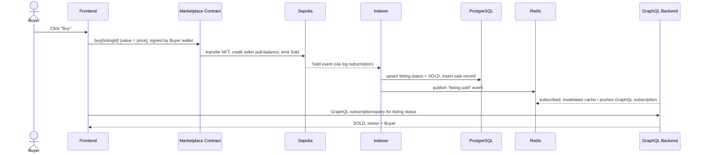

# 03 — System Architecture

## 1. High-Level Component Diagram



## 2. Architectural Style

- **Event-driven, chain-as-source-of-truth.** The backend never trusts its
  own database as ground truth for ownership or balances — it is always a
  projection rebuildable from chain events. This is the single most
  important architectural decision in the system; see
  [ADR-0007](./adr/0007-event-driven-indexer-architecture.md).
- **Clean Architecture on the backend** (domain / application /
  infrastructure / presentation layers) so business rules (fee calculation,
  royalty splitting, listing state machine) are testable without a database
  or a chain connection. Detail in
  [Backend Design](./05-backend-design.md).
- **Modular smart contracts**, each with a single responsibility (NFT,
  Marketplace, Auction as an extension module), composed rather than
  monolithic. Detail in [Smart Contract Design](./04-smart-contract-design.md).
- **Upgradeable by design (UUPS)**, not upgradeable-as-an-afterthought — see
  [ADR-0005](./adr/0005-upgradeable-contracts-uups.md).

## 3. Why the Backend Never Signs Transactions

A recurring anti-pattern in NFT marketplace tutorials is a backend "relayer"
wallet that signs and submits transactions on behalf of users. This project
deliberately avoids that:

- **Custody risk**: a backend-held private key that can move user assets is
  a single point of catastrophic failure.
- **Trust model**: the point of a dApp is that the user's wallet is the only
  thing that can authorize a state change to their assets.
- The backend's job is to **prepare data** (typed calldata parameters,
  EIP-712 typed data where signatures are needed, e.g. SIWE) and to **read**
  indexed chain state — never to hold funds or sign on the user's behalf.

The only exception considered anywhere in this system is Phase 2's Embedded
Wallet feature, which uses a dedicated account-abstraction/custody provider
(not a raw backend-held EOA key) — see
[Phase 2 — Future Scope](./milestones/phase-2-future-scope.md).

## 4. Tech Stack Summary

| Layer | Choice | ADR |
|---|---|---|
| Smart contracts | Solidity + Hardhat + OpenZeppelin (Upgradeable), ethers v6 for scripts/tests | [ADR-0003](./adr/0003-smart-contract-framework.md) |
| Contract testing (fuzz/invariant) | Foundry, introduced narrowly for the Security Hardening milestone | [ADR-0004](./adr/0004-testing-tool-hybrid-hardhat-foundry.md) |
| Network | Ethereum Sepolia testnet only | [ADR-0002](./adr/0002-blockchain-network-and-environment.md) |
| Indexer | Node.js/TypeScript, viem, Prisma, Redis | [ADR-0007](./adr/0007-event-driven-indexer-architecture.md) |
| Backend | NestJS, GraphQL (Apollo, code-first), Prisma, PostgreSQL, Redis/BullMQ | [ADR-0006](./adr/0006-database-orm-choice.md), [ADR-0008](./adr/0008-graphql-vs-rest.md) |
| Auth | SIWE (EIP-4361) + JWT | [ADR-0009](./adr/0009-authentication-siwe.md) |
| Frontend | Next.js, TypeScript, wagmi + viem, RainbowKit, TanStack Query | — (user-selected) |
| NFT metadata storage | IPFS via Pinata | [ADR-0010](./adr/0010-nft-metadata-storage-ipfs.md) |
| Monorepo | Turborepo + pnpm workspaces | [ADR-0001](./adr/0001-monorepo-tooling.md) |
| Hosting | Railway (backend, indexer, Postgres, Redis) + Vercel (frontend) | [ADR-0011](./adr/0011-hosting-railway-vercel.md) |
| CI/CD | GitHub Actions | [DevOps & CI/CD](./11-devops-cicd.md) |

## 5. Data Flow: "Buy Now" (illustrative)



Full set of flows (mint, list, cancel, bid, settle auction, SIWE login) is in
[Sequence Diagrams](./16-sequence-diagrams.md).

## 6. Environments

| Environment | Chain | Backend/Indexer | Frontend | Purpose |
|---|---|---|---|---|
| Local | Hardhat local node (forked or fresh) | Docker Compose | `next dev` | Day-to-day development |
| Staging | Sepolia | Railway (staging service) | Vercel preview | Pre-merge validation, demo links |
| Production | Sepolia (same network — no mainnet in Phase 1) | Railway (production service) | Vercel production | The portfolio-facing deployment |

## 7. Repository Layout

Matches the existing scaffold, mapped to architectural roles:

```
we3_marketplace/
├── apps/
│   ├── frontend/     # Next.js dApp
│   ├── backend/      # NestJS GraphQL API (Clean Architecture)
│   ├── indexer/      # Standalone event-indexing service
│   └── contracts/    # Hardhat project: NFT, Marketplace, Auction, UUPS proxies
├── docs/              # This documentation set
├── infrastructure/    # Docker Compose, IaC, deployment configs
├── scripts/           # Cross-cutting dev/ops scripts
└── README.md
```

`packages/` (shared TypeScript types, ABIs, GraphQL codegen output) is
introduced in Milestone 0 once the monorepo tool is wired up — see
[ADR-0001](./adr/0001-monorepo-tooling.md) and
[Milestone 0](./milestones/milestone-00-foundations.md).
