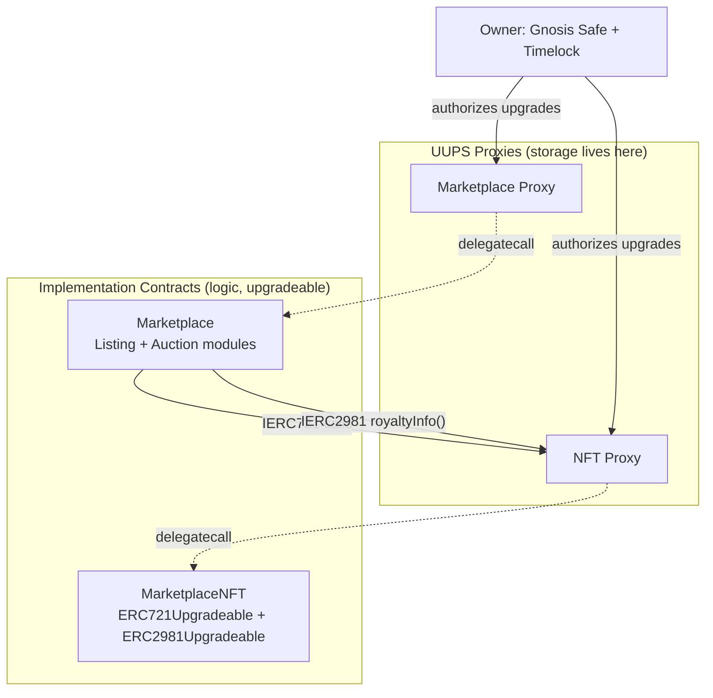

# 04 — Smart Contract Design

## 1. Contract Map (Phase 1)

Each contract has **one responsibility**:

| Contract | Responsibility | Does NOT do |
|---|---|---|
| `MarketplaceNFT` (ERC-721) | Mint, own, transfer tokens; expose `tokenURI`; expose EIP-2981 `royaltyInfo()` | Never handles payments or listing logic |
| `Marketplace` | Fixed-price listing lifecycle (list/buy/cancel), fee + royalty split, pull-payment ledger | Never mints tokens; only moves tokens it has been approved/escrowed to move |
| `Auction` (module of `Marketplace`, same proxy) | English auction lifecycle (bid/withdraw/settle) | Shares the same fee/royalty split logic as fixed-price, via an internal library, to avoid duplicated payment logic |

Phase 2 adds `PaymentToken` (ERC-20), `Membership`, `Governor` + `Timelock`,
each as their own contract — see
[Phase 2 — Future Scope](./milestones/phase-2-future-scope.md).

## 2. Upgradeability: UUPS

- Every user-facing contract (`MarketplaceNFT`, `Marketplace`) is deployed as
  a **minimal ERC-1967 proxy** pointing at a UUPS-compliant implementation
  (OpenZeppelin `UUPSUpgradeable`).
- Upgrade authorization (`_authorizeUpgrade`) is restricted to the contract
  owner, and ownership of both proxies is a **Gnosis Safe multisig behind a
  `TimelockController`** — not a single EOA — from the first Sepolia
  deployment onward. This is deliberately over-engineered relative to a
  "just get it working" MVP, because upgrade-authorization design is exactly
  the kind of thing a portfolio reviewer will check.
- Rationale for UUPS over Transparent Proxy: cheaper per-call (no admin
  check in the proxy's fallback), and the upgrade logic living in the
  implementation makes it easy to permanently remove upgradeability later
  (ship a final implementation whose `_authorizeUpgrade` reverts
  unconditionally) — a meaningful trust signal for a real marketplace.
  Full trade-off discussion in
  [ADR-0005](./adr/0005-upgradeable-contracts-uups.md).

### Storage layout rules (to avoid corrupting state on upgrade)

1. **Never reorder or remove existing state variables.** Only append new
   ones at the end of a contract, or in a newly appended storage-gap slot.
2. Every upgradeable contract reserves a storage gap:
   `uint256[50] private __gap;` at the end of each versioned contract, sized
   down by however many slots a given upgrade consumes.
3. Use OpenZeppelin's `@openzeppelin/hardhat-upgrades` plugin, which runs
   storage-layout validation on every `upgradeProxy` call in CI — an upgrade
   that violates layout compatibility fails the build, not the chain.
4. Constructors are disabled (`_disableInitializers()`); all setup happens
   in an `initialize()` function guarded by `initializer` (or
   `reinitializer(n)` for post-upgrade migrations).

## 3. `MarketplaceNFT` (ERC-721)

- Inherits: `ERC721Upgradeable`, `ERC721URIStorageUpgradeable`,
  `ERC2981Upgradeable`, `OwnableUpgradeable` (transferred to Safe post-deploy),
  `PausableUpgradeable`, `UUPSUpgradeable`.
- `mint(address to, string calldata tokenURI, address royaltyReceiver, uint96 royaltyFeeBps)`:
  anyone can mint to themselves (open minting for a portfolio demo — no
  allowlist in Phase 1); sets per-token royalty via `_setTokenRoyalty`.
- `tokenURI` points to an IPFS CID (`ipfs://<cid>`); resolution to
  `https://gateway/<cid>` happens client-side, never baked into the
  contract.
- `pause()`/`unpause()`: owner-only emergency stop on transfers/mints.

## 4. `Marketplace`

- Inherits: `OwnableUpgradeable`, `PausableUpgradeable`,
  `ReentrancyGuardUpgradeable`, `UUPSUpgradeable`.
- Core state: `mapping(uint256 listingId => Listing)`, monotonic
  `listingId` counter, `mapping(address => uint256) pendingWithdrawals`
  (pull-payment ledger).
- **Escrow model**: seller calls `approve`/`setApprovalForAll` on the NFT
  contract, then `list(...)`. The Marketplace does **not** pull the NFT into
  its own custody until `buy()` executes — minimizing the window an NFT
  spends outside the owner's wallet. Listing validity is re-checked
  on-buy (owner still owns it, approval still valid) so a stale/duplicated
  listing cannot be exploited.
- `list(address nft, uint256 tokenId, uint256 price)` → emits `Listed`.
- `cancel(uint256 listingId)` → only the lister; emits `Cancelled`.
- `buy(uint256 listingId)` payable:
  1. **Checks**: listing exists & active, `msg.value == price`, seller still
     owns & has approved the token.
  2. **Effects**: mark listing `SOLD` first.
  3. **Interactions**: `safeTransferFrom` NFT to buyer; compute
     `royaltyInfo()`; credit `pendingWithdrawals[seller]`,
     `pendingWithdrawals[royaltyReceiver]`, `pendingWithdrawals[feeRecipient]`
     — no raw `.transfer()` to arbitrary addresses inside `buy()`.
  4. Emits `Sold(listingId, buyer, price)`.
- `withdraw()`: pull-payment claim function, `nonReentrant`,
  checks-effects-interactions (zero the balance before sending).
- Protocol fee: a `uint96 feeBps` (owner-configurable, capped at a hardcoded
  max e.g. 500 = 5%) taken from every sale.

## 5. `Auction` module

- Same proxy/storage as `Marketplace` (implemented as a Solidity library +
  mixin, not a separate deployed contract) so listing IDs, fee config, and
  the pull-payment ledger are shared — one source of truth for "what does
  this marketplace take as a fee."
- `createAuction(address nft, uint256 tokenId, uint256 reservePrice, uint64 duration)`.
- `bid(uint256 auctionId)` payable: must exceed `highestBid` by at least a
  configurable minimum increment; previous highest bidder's amount moves to
  `pendingWithdrawals` (never force-sent) — this is the standard mitigation
  for the "malicious bidder with a `receive()` that always reverts" DoS
  vector.
- `settle(uint256 auctionId)`: callable by **anyone** once
  `block.timestamp >= endTime`, not just the seller/winner — avoids a
  griefing seller who refuses to finalize.

## 6. Events (indexer contract)

| Event | Emitted by | Fields |
|---|---|---|
| `Transfer` | `MarketplaceNFT` (standard ERC-721) | `from, to, tokenId` |
| `Listed` | `Marketplace` | `listingId, nft, tokenId, seller, price` |
| `Cancelled` | `Marketplace` | `listingId` |
| `Sold` | `Marketplace` | `listingId, buyer, price` |
| `AuctionCreated` | `Marketplace` (Auction module) | `auctionId, nft, tokenId, seller, reservePrice, endTime` |
| `BidPlaced` | `Marketplace` (Auction module) | `auctionId, bidder, amount` |
| `AuctionSettled` | `Marketplace` (Auction module) | `auctionId, winner, amount` |
| `Withdrawn` | `Marketplace` | `account, amount` |
| `Upgraded` | Proxies (from `UUPSUpgradeable`) | `implementation` |

Every event that changes marketplace state has a corresponding indexer
handler — see [Blockchain Indexer](./08-blockchain-indexer.md).

## 7. Explicitly Rejected Designs (and why)

- **Custom ERC-721 implementation from scratch**: rejected — no benefit over
  audited OpenZeppelin base contracts, adds audit surface for no reason.
- **Synchronous on-chain order book**: rejected — gas cost of maintaining a
  sorted order book on-chain is prohibitive; listings are simple
  ID-addressed structs, discovery/sorting happens off-chain in the indexed
  read model.
- **Marketplace pulling NFTs into escrow at `list()` time**: considered, but
  rejected for Phase 1 — leaving the NFT in the seller's wallet until sale
  is strictly better for the seller (they can still see/use it elsewhere)
  and is the pattern used by Seaport/OpenSea. Documented here because it's
  the first thing a reviewer familiar with older marketplace designs (e.g.
  early CryptoKitties-era escrow marketplaces) will ask about.
