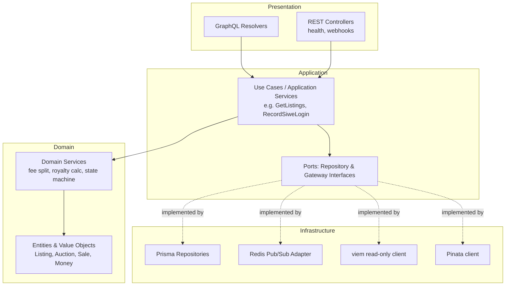

# 05 — Backend Design

## 1. Why Clean Architecture Here

The backend has real business logic that must be correct independent of any
framework or database: fee/royalty split calculation, listing state
transitions, SIWE nonce/session handling. Clean Architecture keeps that logic
testable in isolation (pure unit tests, no DB, no chain, no HTTP) and keeps
NestJS, Prisma, and viem as replaceable details — not the center of the
design.

## 2. Layers



- **Domain**: framework-free TypeScript classes/functions. No NestJS
  decorators, no Prisma types, no GraphQL types. E.g. `Listing.sell(price)`
  returns a new `Listing` in `SOLD` state or throws a domain error — it does
  not know about HTTP or SQL.
- **Application**: use cases orchestrate domain objects via **ports**
  (interfaces) — `ListingRepository`, `EventSubscriber`, `MetadataStore`.
  This is the only layer that knows a use case exists.
- **Infrastructure**: implements the ports. Prisma repositories, the Redis
  subscriber that reacts to indexer events, the read-only viem client used
  only for things the indexer doesn't project yet (rare, e.g. a live
  `balanceOf` check), the Pinata upload client.
- **Presentation**: GraphQL resolvers (primary API) and a small REST surface
  (health checks, Pinata webhook receiver — see
  [API Specification](./12-api-specification.md)). Resolvers are thin: parse
  input, call a use case, map the result to a GraphQL type.

## 3. Module Boundaries (NestJS modules ≈ bounded contexts)

| Module | Owns | Depends on |
|---|---|---|
| `AuthModule` | SIWE nonce issuance/verification, JWT issuance, session guard | none (foundational) |
| `CatalogModule` | NFTs, collections, metadata read model | `AuthModule` (for owner-scoped queries) |
| `MarketplaceModule` | Listings, sales, fee/royalty projections | `CatalogModule` |
| `AuctionModule` | Auctions, bids | `MarketplaceModule` |
| `IndexerBridgeModule` | Redis subscription → domain event dispatch → cache invalidation / GraphQL subscription triggers | all of the above (consumer only, never called by them) |
| `HealthModule` | Liveness/readiness endpoints | none |

Modules never reach into another module's Prisma models directly; they call
the other module's exported application service. This is enforced by
folder-per-module structure plus lint rule (`no-restricted-imports` across
module boundaries), not just convention.

## 4. Directory Structure (`apps/backend/src`)

```
src/
├── modules/
│   ├── auth/
│   │   ├── domain/
│   │   ├── application/
│   │   ├── infrastructure/
│   │   └── presentation/
│   ├── catalog/
│   ├── marketplace/
│   ├── auction/
│   ├── indexer-bridge/
│   └── health/
├── shared/
│   ├── domain/          # Money, Address, Result/Either helpers
│   └── infrastructure/  # Prisma client provider, Redis client provider
└── main.ts
```

## 5. The Backend Never Signs Transactions (recap)

Reiterated from [System Architecture §3](./03-system-architecture.md#3-why-the-backend-never-signs-transactions):
the backend's viem client is **read-only** (no private key configured for
any user-facing flow). It is used only to read fallback on-chain state the
indexer hasn't caught up to yet (e.g., freshly-submitted-tx pending
confirmation) — never to submit transactions on a user's behalf.

## 6. GraphQL Layer

- **Code-first** schema (NestJS `@ObjectType`/`@Resolver` decorators,
  `@nestjs/graphql` + Apollo Server) — chosen over schema-first because
  types stay colocated with resolver logic and TypeScript is the single
  source of truth, matching the author's existing NestJS experience.
- Full schema in [GraphQL Schema](./13-graphql-schema.md). Subscriptions
  (via `graphql-ws`) are backed by the Redis pub/sub the indexer publishes
  to — a GraphQL subscription is just a thin adapter over
  `IndexerBridgeModule`, not a second source of truth.

## 7. Background Jobs (BullMQ)

| Queue | Job | Trigger |
|---|---|---|
| `metadata-pin` | Pin uploaded image + metadata JSON to Pinata, retry on failure | User upload during mint flow |
| `reorg-check` | Re-validate the last N indexed blocks | Indexer, on a timer |
| `notification-dispatch` (Phase 2) | Fan out a domain event to email/webhook | Redis pub/sub message |

BullMQ (Redis-backed) is used instead of ad-hoc `setTimeout`/cron because
every job here needs retry-with-backoff and needs to survive a process
restart — both are BullMQ defaults, not something to hand-roll.

## 8. Error Handling

- Domain layer throws typed domain errors (e.g. `ListingNotActiveError`).
- Application layer lets them propagate.
- Presentation layer (a global GraphQL exception filter) maps domain errors
  to typed GraphQL errors with stable `code` fields (`LISTING_NOT_ACTIVE`,
  `UNAUTHORIZED`, etc.) — the frontend switches on `code`, never on message
  text.
- No error handling is added for conditions that can't occur given the
  domain's own invariants (e.g., no null-check for a `Listing` that a
  repository is typed to always return non-null for a valid ID — the
  repository throws `NotFoundError` itself instead).
