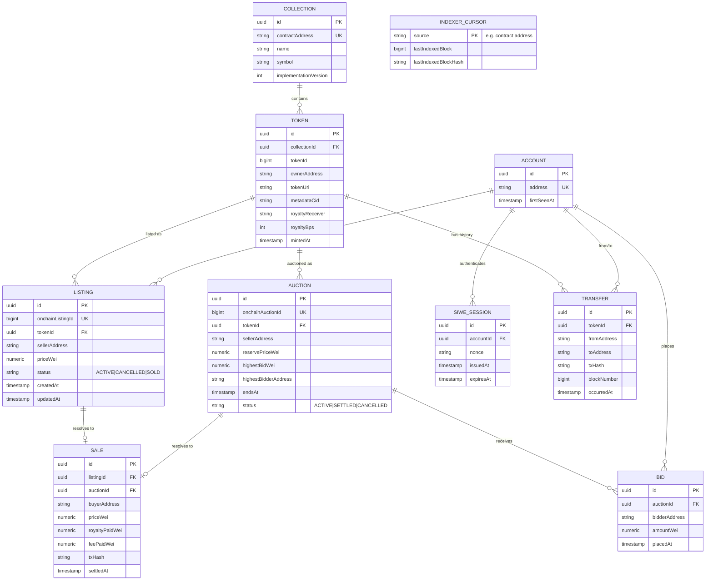

# 07 — Database Design

## 1. Role of the Database

PostgreSQL holds a **read-optimized projection** of on-chain state plus
purely off-chain concerns (SIWE sessions, IPFS pin bookkeeping). It is
rebuildable from chain history at any time by replaying events through the
indexer — see [Blockchain Indexer](./08-blockchain-indexer.md). No table in
this schema is ever the sole source of truth for ownership, balances, or
funds.

## 2. ORM

**Prisma**, chosen over TypeORM (the more common default in NestJS
tutorials) — see [ADR-0006](./adr/0006-database-orm-choice.md) for the full
trade-off. Schema lives in `apps/backend/prisma/schema.prisma` and is shared
(via a generated client package) with the indexer, since both write to
overlapping tables.

## 3. Entity-Relationship Diagram

## 4. Notes on Key Tables

- **`INDEXER_CURSOR`** is the most operationally important table: it is how
  the indexer knows where to resume after a restart, and it stores the
  block **hash**, not just the number, specifically so a reorg can be
  detected (see [Blockchain Indexer §4](./08-blockchain-indexer.md)).
- **`TOKEN.ownerAddress`** is a denormalized projection updated on every
  `Transfer` event — authoritative owner is always `ownerOf()` on-chain; this
  column exists purely so the catalog can be queried/filtered by owner
  without an RPC call per token.
- **Money columns are `numeric` (arbitrary precision), stored in wei as
  integers**, never `float`/`double`. This is a hard rule — floating point
  cannot represent wei-precision values correctly at the sizes involved.
- **`LISTING.status` / `AUCTION.status`** are the off-chain projection of an
  on-chain enum; both are written only by the indexer in response to events,
  never mutated directly by an API mutation (the API only ever *initiates* a
  chain transaction; the *effect* on these tables always flows from an
  indexed event).

## 5. Indexing Strategy

| Table | Index | Purpose |
|---|---|---|
| `TOKEN` | `(collectionId, tokenId)` unique | Lookup by on-chain identity |
| `TOKEN` | `(ownerAddress)` | "My NFTs" queries |
| `LISTING` | `(status, createdAt DESC)` | Marketplace grid, newest-active-first |
| `LISTING` | `(sellerAddress, status)` | "My listings" |
| `AUCTION` | `(status, endsAt)` | "Ending soon" sort, background settlement checks |
| `TRANSFER` | `(tokenId, occurredAt)` | Provenance history per token |
| `SIWE_SESSION` | `(nonce)` unique, TTL-cleaned | Prevent nonce replay |

## 6. Migrations

Prisma Migrate, one migration per schema change, committed to
`apps/backend/prisma/migrations/`. No manual schema edits against a running
database in any environment — migrations are the only path, including in
staging/production (enforced via CI: `prisma migrate deploy` is the only
command with production DB credentials, run only during the deploy step —
see [DevOps & CI/CD](./11-devops-cicd.md)).

## 7. Rebuild-from-chain Guarantee

Because the schema is a projection, a documented "nuke and rebuild" runbook
exists: truncate all projection tables except `ACCOUNT`/`SIWE_SESSION`
(genuinely off-chain data), reset `INDEXER_CURSOR` to the collection's
deployment block, and let the indexer replay history. This is exercised at
least once (see [Milestone 5](./milestones/milestone-05-blockchain-indexer.md)
acceptance criteria) so it isn't a theoretical property.
