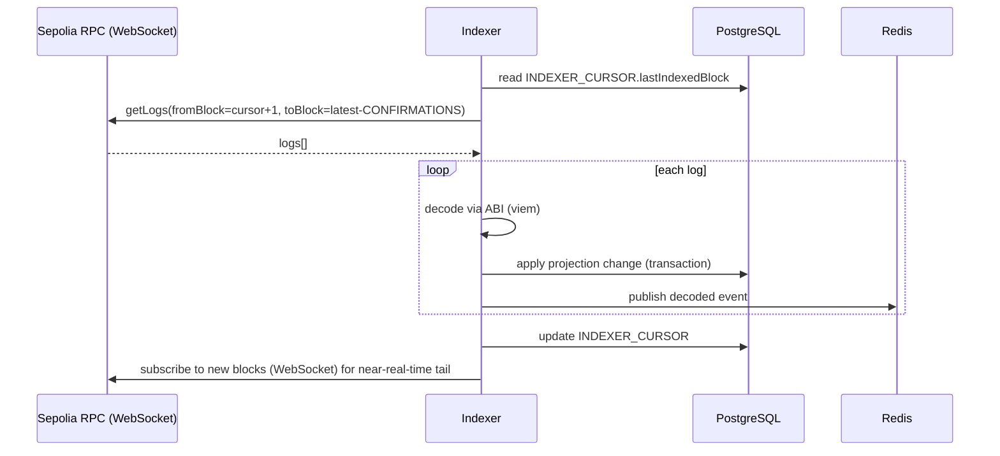

# 08 — Blockchain Indexer

## 1. Responsibility

A standalone service (`apps/indexer`) whose only job is: subscribe to
contract events on Sepolia, decode them, write a normalized projection to
PostgreSQL, and publish decoded domain events to Redis. It has no HTTP API
and is not called by the backend synchronously — it is a producer, the
backend is a consumer.

## 2. Why a Separate Service (not a NestJS module)

- **Independent scaling/restart**: the indexer's failure mode (RPC
  disconnect, reorg handling) is unrelated to backend request load; coupling
  them means an indexer crash-loop can take down the API.
- **Single writer principle**: only the indexer writes to the projection
  tables (`TOKEN`, `LISTING`, `AUCTION`, `SALE`, `TRANSFER`,
  `INDEXER_CURSOR`). Keeping it a separate process makes "who writes this
  table" a deployment-boundary fact, not just a convention someone can
  accidentally violate from inside a shared NestJS process.
- Matches the event-driven architecture requirement directly: chain →
  indexer → DB/Redis → backend, one direction, no cycle.

## 3. Ingestion Strategy

- **Backfill mode**: on first run (or after the "rebuild from chain" runbook),
  paginate `getLogs` from the contract's deployment block to
  `latest - CONFIRMATIONS` in bounded ranges (RPC providers cap log query
  size).
- **Live mode**: WebSocket subscription for new blocks/logs once caught up,
  falling back to polling if the WebSocket drops.
- **Confirmations (`CONFIRMATIONS = 5` on Sepolia)**: logs are only applied
  to the DB once `blockNumber <= latest - CONFIRMATIONS`, trading a few
  seconds of latency for reorg safety.

## 4. Reorg Handling

- `INDEXER_CURSOR` stores both `lastIndexedBlock` **and**
  `lastIndexedBlockHash`.
- On each run, before ingesting new logs, the indexer re-fetches the block
  at `lastIndexedBlock` and compares its hash to the stored one.
  - **Match**: proceed normally.
  - **Mismatch**: a reorg happened. Walk backward block-by-block until
    hashes match again (the common ancestor), delete/rewind projection rows
    tied to the orphaned block range (transfers, sales, listing status
    changes recorded from those blocks), then re-ingest forward from the
    common ancestor.
- This logic is unit-tested against a simulated reorg (Hardhat's
  `evm_revert`/forked chain manipulation) — see
  [Testing Strategy](./10-testing-strategy.md).

## 5. Idempotency

Every projection write is keyed by `(txHash, logIndex)` for a dedup guard
table (or a unique constraint on the natural key it updates, e.g.
`onchainListingId`), so re-processing the same log (from a retry, or from
reorg replay) is a safe no-op, never a duplicate row or double-counted
event.

## 6. Event → Projection Mapping

| Event | Projection effect |
|---|---|
| `Transfer` | Upsert `TOKEN.ownerAddress`; insert `TRANSFER` row |
| `Listed` | Insert `LISTING` (status `ACTIVE`) |
| `Cancelled` | Update `LISTING.status = CANCELLED` |
| `Sold` | Update `LISTING.status = SOLD`; insert `SALE` |
| `AuctionCreated` | Insert `AUCTION` (status `ACTIVE`) |
| `BidPlaced` | Update `AUCTION.highestBid*`; insert `BID` |
| `AuctionSettled` | Update `AUCTION.status = SETTLED`; insert `SALE` |
| `Upgraded` | Update `COLLECTION.implementationVersion` (observability, not correctness-critical) |

## 7. Redis Fan-out

- Each applied projection change publishes a message on a
  per-entity-type channel (`listing.updated`, `auction.updated`,
  `token.transferred`) containing the entity's new state (not just an ID —
  saves the backend a round trip for the common case).
- The backend's `IndexerBridgeModule` subscribes and (a) invalidates any
  relevant cache, (b) republishes to GraphQL subscription clients.
- Phase 2's notification worker will subscribe to the same channels — the
  indexer does not need to change when that ships.

## 8. Failure Modes & Operational Notes

| Failure | Handling |
|---|---|
| RPC provider drops WebSocket | Reconnect with backoff; on reconnect, resume from `INDEXER_CURSOR`, not from "now" — no gap. |
| Indexer process crashes mid-batch | DB writes for a batch happen inside a single Postgres transaction alongside the cursor update, so a crash mid-batch loses at most the in-flight batch, not committed state; restart resumes from last committed cursor. |
| Two indexer instances running (deploy overlap) | Idempotent writes (see §5) make this safe but wasteful; Railway deploy config is single-instance for this service (see [DevOps & CI/CD](./11-devops-cicd.md)). |
| RPC rate limiting during backfill | Bounded batch size + exponential backoff between `getLogs` calls. |

## 9. Explicitly Not Using TheGraph / a Hosted Subgraph Service

Considered and rejected for this project: a hosted subgraph would remove the
need to write this service at all, but the explicit goal (per project
requirements) is to demonstrate building an event-driven indexer, not to
integrate a third-party indexing product. A custom indexer is also easier to
extend with off-chain-only side effects (Redis fan-out, notifications) than
a subgraph's declarative mapping model.
