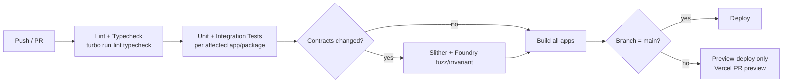

# 11 — DevOps & CI/CD

## 1. Environments

| Environment | Chain | Backend + Indexer | DB/Redis | Frontend |
|---|---|---|---|---|
| **Local** | Hardhat local node | Docker Compose (`docker-compose.yml` in `infrastructure/`) | Dockerized Postgres/Redis | `next dev` |
| **Staging** | Sepolia | Railway (separate services, staging environment) | Railway-managed Postgres/Redis (staging instance) | Vercel Preview Deployments (per-PR) |
| **Production** | Sepolia (no mainnet in Phase 1) | Railway (production environment) | Railway-managed Postgres/Redis (production instance) | Vercel Production |

Hosting choice (Railway + Vercel over AWS) documented in
[ADR-0011](./adr/0011-hosting-railway-vercel.md).

## 2. Repository & Monorepo Tooling

- **Turborepo** + **pnpm workspaces** (see
  [ADR-0001](./adr/0001-monorepo-tooling.md)) — `turbo.json` defines the
  task graph (`build`, `test`, `lint`) with caching, so CI only rebuilds/
  retests packages actually affected by a given change.
- Shared packages: `packages/contracts-abi` (generated ABIs + addresses per
  environment), `packages/graphql-types` (codegen output consumed by
  frontend), `packages/config` (shared ESLint/TS config).

## 3. CI Pipeline (GitHub Actions)

- **Workflow files**: `.github/workflows/ci.yml` (lint/test/build on every
  PR), `.github/workflows/deploy-contracts.yml` (manual/tag-triggered,
  deploys + verifies on Sepolia Etherscan, writes addresses to
  `packages/contracts-abi`), `.github/workflows/deploy-backend.yml`,
  `.github/workflows/deploy-frontend.yml` (Vercel is largely
  self-service via its GitHub integration, but explicit workflow keeps the
  deploy step visible/auditable alongside the others).
- **Contract deploys are never automatic on merge** — they are a deliberate,
  reviewed, manually-triggered workflow (with the Timelock+Safe governing
  any upgrade beyond initial deploy) since a bad automatic contract deploy
  is far more costly to undo than a bad backend deploy.

## 4. Deployment Order (Full Stack Release)

1. Deploy/upgrade contracts to Sepolia (manual trigger) → verify on
   Etherscan → publish new addresses/ABI to `packages/contracts-abi`.
2. Deploy indexer (picks up new addresses from the shared package; if a
   contract was upgraded rather than newly deployed, no indexer redeploy is
   needed unless the ABI/event shape changed).
3. Run Prisma migrations (`prisma migrate deploy`) against the target
   environment's database.
4. Deploy backend.
5. Deploy frontend.

This order exists because later steps depend on earlier ones (frontend
needs the backend's schema to match; backend/indexer need the deployed
contract addresses) — reversing it produces a broken intermediate state.

## 5. Configuration & Secrets

- Environment variables per environment (local/.env, staging/production via
  Railway & Vercel dashboards), never committed. `.env.example` per app
  documents required keys.
- Key secrets: `SEPOLIA_RPC_URL` (+ fallback), `DEPLOYER_PRIVATE_KEY`
  (Sepolia-only test key, never reused, rotated if exposed), `PINATA_API_KEY`,
  `DATABASE_URL`, `REDIS_URL`, `JWT_SECRET`, `ETHERSCAN_API_KEY` (for
  contract verification).

## 6. Monitoring & Observability

| Concern | Tool |
|---|---|
| Application errors (backend, indexer, frontend) | Sentry |
| Structured logs | Pino (backend/indexer), shipped to Railway's log viewer; queryable during Milestone 10 |
| Uptime / liveness | Railway health checks against `HealthModule` endpoints |
| Indexer lag (how far behind chain tip) | Custom metric (`latestIndexedBlock` vs chain tip) exposed via a `/health` field and logged; alert threshold defined in Milestone 10 |
| Contract events sanity | A lightweight scheduled check comparing on-chain `totalSupply`/listing counts to the DB projection, alerting on drift |

Kept intentionally minimal for a portfolio project (no full
Prometheus/Grafana stack) — Sentry + structured logs + a couple of custom
health metrics are enough to demonstrate operational maturity without
over-building ops tooling nobody but the author will look at. Full
Prometheus/Grafana is a reasonable Phase 2+ addition if this becomes a
multi-user real deployment.

## 7. Rollback Strategy

- **Backend/Frontend**: Railway/Vercel both support instant rollback to a
  previous deploy — used for any regression that isn't a contract-level
  issue.
- **Contracts**: UUPS upgrade is itself the rollback mechanism — upgrading
  back to the previous implementation address is possible as long as
  storage layout compatibility holds in both directions (see
  [Smart Contract Design §2](./04-smart-contract-design.md)); no destructive
  migration is ever the *only* forward path.
- **Database**: Prisma migrations are additive-first where possible;
  destructive migrations (column drops) are only run after the
  corresponding code has been fully rolled out and confirmed stable.
