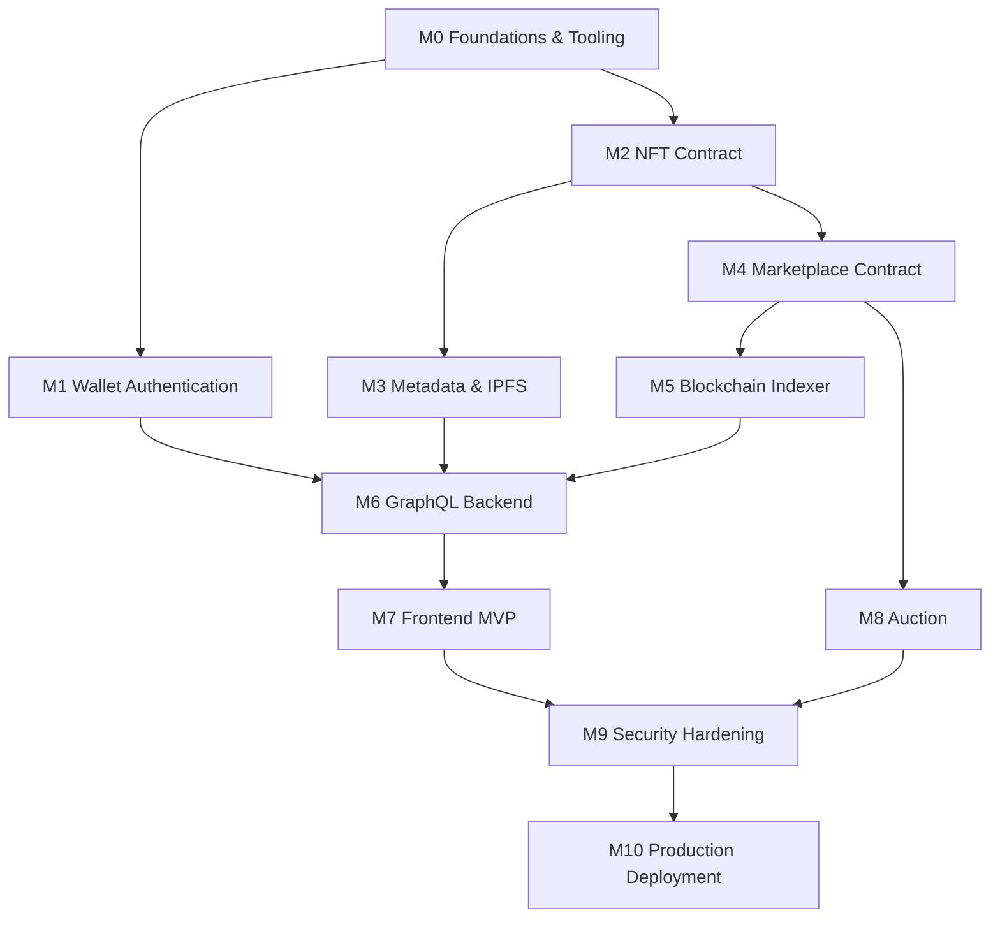

# 15 — Milestone Roadmap

## 1. Structure

Phase 1 is the committed scope: 11 milestones, implemented **in order**,
each fully shippable before the next begins (per
[Project Overview](./01-project-overview.md), guiding principle 4). Phase 2
is documented at a lighter level of detail in
[Phase 2 — Future Scope](./milestones/phase-2-future-scope.md) and is not
scheduled.

Detailed per-milestone docs (Goal, Knowledge required, Tasks, Acceptance
Criteria, Definition of Done, Risks, Suggested commit plan) live in
`milestones/`. This document is the map between them.

## 2. Dependency Graph

## 3. Phase 1 Milestones

| # | Milestone | One-line goal | Doc |
|---|---|---|---|
| M0 | Foundations & Tooling | Monorepo, Docker Compose, CI skeleton, scaffolds for all four apps | [milestone-00-foundations.md](./milestones/milestone-00-foundations.md) |
| M1 | Wallet Authentication | SIWE sign-in issuing a backend session | [milestone-01-wallet-authentication.md](./milestones/milestone-01-wallet-authentication.md) |
| M2 | NFT Contract | UUPS-upgradeable ERC-721 with EIP-2981 royalties, minting works on Sepolia | [milestone-02-nft-contract.md](./milestones/milestone-02-nft-contract.md) |
| M3 | Metadata & IPFS | Upload pipeline pinning image + metadata to Pinata | [milestone-03-metadata-ipfs.md](./milestones/milestone-03-metadata-ipfs.md) |
| M4 | Marketplace Contract | Fixed-price list/buy/cancel with fee + royalty split, pull-payments | [milestone-04-marketplace-contract.md](./milestones/milestone-04-marketplace-contract.md) |
| M5 | Blockchain Indexer | Event ingestion, reorg handling, Redis fan-out, rebuild-from-chain proven | [milestone-05-blockchain-indexer.md](./milestones/milestone-05-blockchain-indexer.md) |
| M6 | GraphQL Backend | Clean Architecture API over the indexed read model | [milestone-06-graphql-backend.md](./milestones/milestone-06-graphql-backend.md) |
| M7 | Frontend MVP | Full mint → list → buy golden path in the browser | [milestone-07-frontend-mvp.md](./milestones/milestone-07-frontend-mvp.md) |
| M8 | Auction | English auction (bid/withdraw/settle) end to end | [milestone-08-auction.md](./milestones/milestone-08-auction.md) |
| M9 | Security Hardening | Slither clean, Foundry fuzz/invariant suite, multisig+timelock wired | [milestone-09-security-hardening.md](./milestones/milestone-09-security-hardening.md) |
| M10 | Production Deployment | Full stack live on Sepolia + Railway + Vercel, monitoring wired | [milestone-10-production-deployment.md](./milestones/milestone-10-production-deployment.md) |

## 4. Why This Order

- **M0 before anything**: no app should be scaffolded ad hoc; the monorepo
  tooling decision ([ADR-0001](./adr/0001-monorepo-tooling.md)) affects
  every subsequent milestone's file layout.
- **M1 (auth) and M2 (NFT contract) in parallel-capable order early**:
  neither depends on the other, both are prerequisites for the backend
  (M6) — auth for session handling, NFT contract for the indexer/catalog to
  have something to index.
- **M4 (Marketplace) before M5 (Indexer)**: the indexer needs a stable set
  of events to index; writing it against a contract that's still changing
  its event signatures would mean redoing indexer work.
- **M5 before M6**: the backend's read model is the indexer's output — a
  GraphQL API with nothing indexed yet is not testable end-to-end.
- **M8 (Auction) after M7 (Frontend MVP)**: the fixed-price golden path
  (mint → list → buy) is the smallest complete product; shipping it fully
  (including frontend) before adding auction complexity keeps a working
  demo available at every point, matching the "Phase 1 vs Phase 2"
  philosophy applied recursively within Phase 1 itself.
- **M9 (Security Hardening) after both M4 and M8's contracts exist**: fuzz/
  invariant testing is most valuable once the full contract surface
  (fixed-price + auction) is stable, rather than fuzzing a contract that's
  about to gain new functions.
- **M10 (Production Deployment) last**: deploying "production-grade"
  infrastructure before the product it hosts is feature-complete and
  security-hardened would be deploying a moving target.

## 5. Definition of "Milestone Done" (applies to every milestone doc)

A milestone is not done when the code merges — it is done when:

1. All its Acceptance Criteria are demonstrably true (manually verified,
   not just "tests pass" — see each milestone's own criteria).
2. Its Definition of Done checklist (tests, docs, deploy where applicable)
   is satisfied.
3. Any design doc it touches (in `docs/`) has been updated to match what
   was actually built, if reality diverged from the original design during
   implementation.

## 6. Phase 2

See [Phase 2 — Future Scope](./milestones/phase-2-future-scope.md) for
ERC-20 Payment, Membership NFT, DAO Governance, Embedded Wallet, Admin
Dashboard, Blockchain Explorer, and Notification System — scoped at a
lighter level of detail since they are not scheduled, per
[ADR-0012](./adr/0012-phase2-scope-deferral.md).
