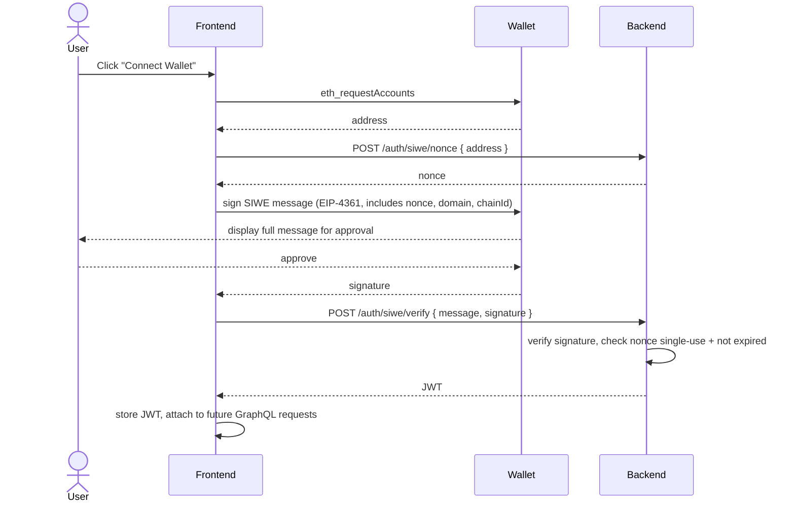
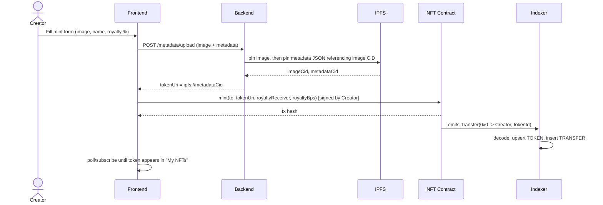
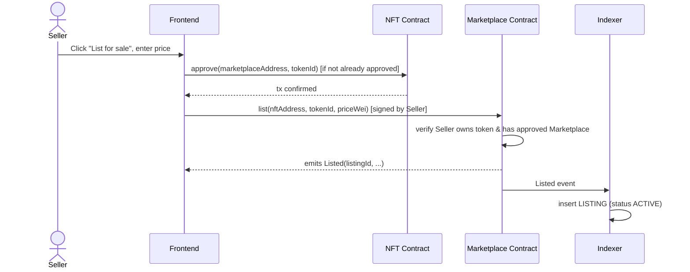
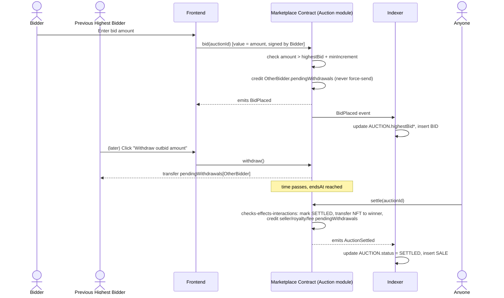
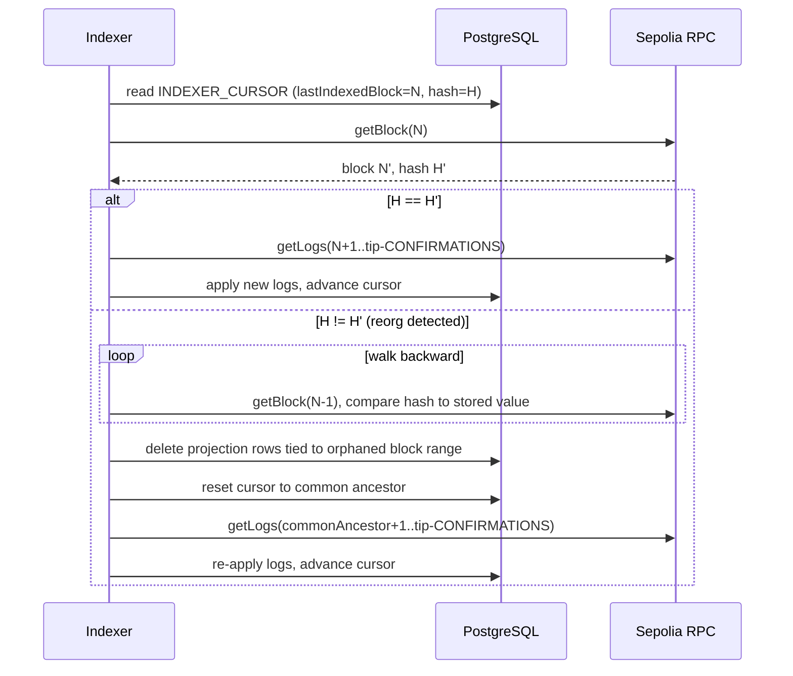

# 16 — Sequence Diagrams

Cross-system flows referenced from other docs. "Buy Now" already appears in
[System Architecture §5](./03-system-architecture.md#5-data-flow-buy-now-illustrative);
not repeated here.

## 1. SIWE Sign-In

## 2. Mint NFT

## 3. List for Fixed Price

## 4. Place Bid / Settle Auction

## 5. Reorg Detection & Rewind (Indexer)

